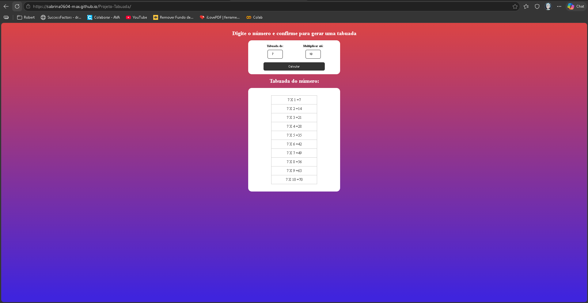

# 🔢 Projeto Tabuada

Projeto simples que gera a tabuada de um número escolhido pelo usuário, desenvolvido com HTML, CSS e JavaScript.

## 📸 Preview



---

## 🚀 Tecnologias utilizadas

- HTML5
- CSS3
- JavaScript

---

## 🎯 Funcionalidades

- Usuário escolhe o número da tabuada
- Definição do limite de multiplicação
- Geração dinâmica da tabela
- Atualização automática dos resultados
- Interface simples e responsiva

---

## 📂 Estrutura do projeto

```bash
📁 Projeto-Tabuada
 ├── index.html
 ├── style.css
 ├── script.js
```

---

## ▶️ Como executar o projeto

1. Clone o repositório:

```bash
git clone https://github.com/sabrina0604-max/Projeto-Tabuada.git
```

2. Abra o arquivo `index.html` no navegador.

---

## 💻 Demonstração

Acesse o projeto online:

[Acessar projeto](https://sabrina0604-max.github.io/Projeto-Tabuada/)

---

## 📌 Aprendizados

- Manipulação do DOM
- Eventos de formulário
- Uso de loops (`for`)
- Criação dinâmica de elementos
- Interação com inputs do usuário

---

## 👩‍💻 Autora

Feito por [Sabrina Rodrigues Medeiros](https://github.com/sabrina0604-max)
